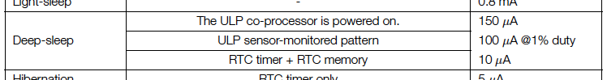

# Deepsleep

The deepsleep mode of ESP32 allows you to shut down power consuming components (such as CPU or WiFi) and save battery. Read more about the different energy modes in the [ESP MCU datasheet](https://www.espressif.com/sites/default/files/documentation/esp32_datasheet_en.pdf) or the [Espressif Docs](https://docs.espressif.com/projects/esp-idf/en/latest/esp32/api-reference/system/sleep_modes.html) (active, modem sleep (wifi off), light sleep, deep sleep, hibernation).

In this exercise you can practise to send the ESP to deepsleep and wake it up.

The goal is: the esp32 should sleep until someting wake it up. When it wakes up, it should connect to the home wifi, call n URL (to do something, count data for instance) and finally fall asleep again.

1. to send the esp to deepsleep the funcion ``esp_deep_sleep_start()`` can be called
2. to wake it up there are three different approaches: timer-based, on touch-input or with the GPIOs that still work with the RTC controller (called RTC GPIOs or RTCIO).
3. For the beginning set up the esp to conntect to the home wifi (wifi connection already part of another cooking recipe), call a URL (call your Telegram Bot, call [Thingspeak](http://thingspeak.com) or call something withing your (smart home) network) and finally fall asleep in deepsleep mode (and never wake up again). This functionallity can be part of the setup function. No need of the loop in here.
4. Next, you can use a timer, to wake the ESP up again. The timer should be initialized before esp falls asleep! With ``esp_sleep_enable_timer_wakeup(MICROSECONDS);`` you can set the timer.
5. Now, lets wake up the esp with a touch input. Use ``touchAttachInterrupt(PIN, CALLBACKFUNC, THRESHOLD)`` to set an appropriate touch input pin and ``esp_sleep_enable_touchpad_wakeup()`` to enable touchpad wakeup. There is a little trap regarting the callback function of the touch pin: this only works if you hold the pin for a long time. So it's a better approach catch the touched pin after boot with ``esp_sleep_get_touchpad_wakeup_status`` (returns touch id, not id of GPIO) and identify with pin has been touched (with if else of switch).
6. The final test would be to wake up the esp using another type of sensor on the RTCIO (a push button for instance). [Here](https://randomnerdtutorials.com/esp32-deep-sleep-arduino-ide-wake-up-sources/) you'll find a great ressource with further information.

Consider the deepsleep for your outdoor prototypes, to save energy. Note: on our Dev-Boards there is a power status led that is power consumting, too.